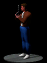

# Flashback 3DO Technical Notes

<figure style="text-align: center;">
  
  <figcaption>Figure 1: Flashback logo</figcaption>
</figure>

## Files

Same format as Amiga

| Extension | Description                                        |
|:---------:|----------------------------------------------------|
|  `.CT`    | Level grid, compressed with bytekiller             |
|  `.LEV`   | Room tiles attributes, compressed with bytekiller  |
|  `.PAL`   | Amiga 16 colors palettes (RGB444)                  |
|  `.MBK`   | Graphic tiles                                      |
|  `.PGE`   | Triggers                                           |
|  `.RP`    | ?                                                  |
|  `.SGD`   | Graphic tiles for Level 1 (Jungle)                 |

## Rendering

Flashback was originally developed for the Sega Megadrive and its
rendering code is based on a tile based hardware.

The backgrounds are made up of several tiles (of different resolutions,
eg. 128x44, 16x16) composed when loading.

This is very efficient on hardware supporting these. Load the graphics
to the dedicated memory and load the attributes to the other dedicated memory.

As the PC does not have this kind of hardware acceleration, it comes with
pre-processed level backgrounds. The `.MAP` files contain all of the
background bitmaps (256x224) of a given level. The Macintosh version also
used the same pre-processing. Loading and displaying since then just a
matter of decoding the bitmap directly to a video buffer.

The 3DO does not come with preprocessed background bitmaps but draws in 
software the background bitmaps by reading the `.LEV` files for
attributes (flipping, xy) and decoding the graphic tiles found in `.BNQ`
and `.SGD` files.

The executable relies on 256x228 `.cel` files as place-holders where
the software decoded graphics are rendered to.

## Differences with Amiga/PC

### Texts

On Amiga/PC, the in-game texts are stored in the executable. The
3DO reworked that and texts are now read from `.BIN` files
(under the `Langs/` directory).

### Passwords

On Amiga/PC, the passwords are not stored in clear in the executable.
Each password character is obfuscated by reversing the bits and a xor.

Running `strings` on the executable of the 3DO lists the level access
codes.

  - `GATORSDIABLOPMBRTNEXPO`
  - `PATROLBOOGIETREK`
  - `LEAGUEANIMALQUASI`
  - `BANG`
  - `TIMERSSTALIOSHKSPRLASSO`
  - `STRIKEKNOCK`
  - `POKER`
  - `ATOMICKNUCKLDYNSTYANNUIT`

### Cutscenes

This version includes CG cutscenes, replacing the original polygons
based. The quality is similar to the PC CD-ROM release.

The videos are encoded with Cinepak.

Japanese subtitles are present and can be rendered on top of the video.

<figure style="text-align: center;">
  
  <figcaption>Figure 2: voyage.sub</figcaption>
</figure>

The `.DAT` files contains the timing information (frame number) indicating
when the bitmaps need to be rendered on top of the video. The bitmaps are
stored in .SUB.

### Sounds

The PC version uses Fibonacci-delta encoded samples at 6000Hz. The Amiga
version uses uncompressed PCM at sample rate (PAULA / 650).

The 3DO version comes with uncompressed 8 bits mono samples at 8000Hz.

### Checkpoints

The 3DO version plays a voice sample ("Game saved") when the game state
has been written. Although there is an existing playSound opcode, the
change has been done directly in the engine code when performing a game
state save.

```asm
.text:0000A034    ADR    R1, aGamesave_aif ; "GAMESAVE.AIF"
.text:0000A038    MOV    R0, #66
.text:0000A03C    BL     load_aif

.text:000125DC ; jumptable 00011FC8 entry 104
.text:000125DC    BL     pge_op_saveState

.text:00007328 pge_op_saveState
.text:00007344    MOV    R0, #66     ; gamesave.aif
.text:00007348    BL     play_sound
```

## Unused assets

### Menu animation

The Conrad animation played in the main menu comes with two encodings, one `Uncoded16` (RGB555) and another one `coded8` (paletted).

<figure style="text-align: center;">
  
  
  <figcaption>Figure 3: The RGB555 and paletted versions of the Conrad animation</figcaption>
</figure>

`Conrad.coded8` is loaded if `Conrad.smlanim.Uncoded16` fails.

```asm
.text:00009C4C     ADR     R0, aBootGlobalConr ; "$boot/Global/Conrad.smlanim.Uncoded16"
.text:00009C50     MOV     R1, #0x40000
.text:00009C54     BL      load_cel_anim
...
.text:00009C60     TEQ     R0, #0
.text:00009C64     BNE     return
.text:00009C68     ADR     R0, aBootGlobalCo_0 ; "$boot/Global/Conrad.coded8"
.text:00009C6C     MOV     R1, #0x40000
.text:00009C70     BL      load_cel_anim
...
.text:00009C7C     TEQ     R0, #0
.text:00009C80     BNE     return
.text:00009C84     ADR     R0, aCanTLoadConrad ; "Can't load Conrad animation\n"
.text:00009C88     SVC     0x1000E
```

### Level music

Background level music can be found in the tunes/ directory. At least
with the US version, the music is only played when in demo mode. During
regular playback, only sounds can be heard.

Looking at the disassembly, this is seems done on purpose. The code has
three checks if a demo file (`Demo/DEMOx.TEST`) is loaded:

  - cutscene playback is disabled
  - sounds are not played
  - background level music is played

```asm
.text:00008B28     LDR     R0, =_demoNumTestPtr
.text:00008B2C     LDR     R0, [R0]
.text:00008B30     TEQ     R0, #0
.text:00008B34     BNE     loc_8B40
.text:00008B38     MOV     R0, #0
.text:00008B3C     BL      play_cutscene
.text:00008BBC     ADR     R0, aBootLevelsLe_5 ; "$boot/Levels/LEVEL1.CT2"
.text:00008BC0     BL      load_file
...
.text:00008BCC     LDR     R0, =_demoNumTestPtr
.text:00008BD0     LDR     R0, [R0]
.text:00008BD4     TEQ     R0, #0
.text:00008BD8     BEQ     loc_8BE4
.text:00008BDC     MOV     R0, #2
.text:00008BE0     BL      play_music
```

Patching the executable (eg. by changing the `BEQ` instruction to a
`NOP`) enables playback of both background music and sound effects
during game play. A playthrough of the first level shows no major
glitches. It is unclear why the feature was conditioned.
