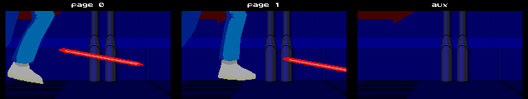
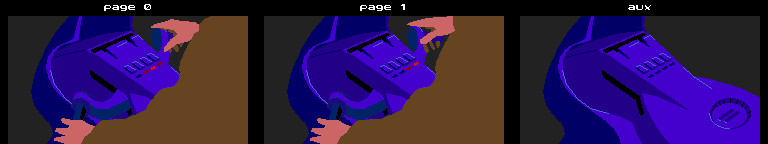

# Flashback Cutscene Player

## Files

On PC:

  - `.POL` files contain shapes polygons and palette colors.
  - `.CMD` files contain bytecode for one or several animations.

The Amiga version bundles the two files into a single file (`.CMP`)
compressed with bytekiller. All data is indexed, so a `.POL` file
will contain 4 offsets tables:

  - shape offset
  - shape data
  - vertices offset
  - vertices data

This allows to reduce and re-use vertices data.

## Opcodes

The cutscene player routine interprets 14 opcodes.
| Num | Name                   | Description                                                 |
|:---:|------------------------|-------------------------------------------------------------|
|  0  | `markCurPos`           | set delay = 5, update palette, flip graphics buffer         |
|  1  | `refreshScreen`        | set clearScreen, if 0 clear by copying pageAux and use 2nd palette, otherwise clear with 0xC0 and use first palette    |
|  2  | `waitForSync`          | set delay = n * 4                                           |
|  3  | `drawShape`            | draw shape, if clearScreen != 0, page1 is copied to pageAux |
|  4  | `setPalette`           | load 16 colors palette (RGB444)                             |
|  5  | `markCurPos`           | same as `0x00`                                              |
|  6  | `drawCaptionText`      | draw text below the animation                               |
|  7  | `nop`                  | do nothing                                                  |
|  8  | `skip3`                |                                                             |
|  9  | `refreshAll`           | same as `0x00` + `updateKeys` (`0x0E`)                      |
| 10  | `drawShapeScale`       | draw shape with scaling                                     |
| 11  | `drawShapeScaleRotate` | draw shape with scaling and rotation                        |
| 12  | `drawCreditsText`      | set delay = 10, update palette, copy `page0` to `page1`     |
| 13  | `drawTextAtPos`        | draw string on top of the animation                         |
| 14  | `handleKeys`           | poll key inputs (used in Level 2 and job description cutscenes) |

## Rendering

The cutscene player allocates 3 buffers of 240x128 bytes:
  - 2 buffers (`page0`, `page1`) are used for double buffering
  - 1 buffer (`pageAux`) is used to keep a copy of previously drawn
    primitives. This is typically used as an optimization to avoid redrawing
    the background.

<figure style="text-align: center;">
    
    
    <figcaption>Figure 1: Examples of buffers during the intro cutscene</figcaption>
</figure>

There are 3 drawing primitives:
  - polygon (n points)
  - ellipse
  - pixel

Each primitive can be transformed:
  - scaling
  - rotation
  - vertical and horizontal stretching

Animations are based on a palette of 16 colors (RGB444), with alpha blending
achieved by allocating the upper half of the palette colors to blended
colors. Turning a pixel transparent is then done by `OR`-ing its palette color
index with 8 (bit 3).

## Copy protection

The copy protection of the game relies on the same cutscene player to draw and
zoom out the shapes. There are no external files, the data is embedded in the
executable.
